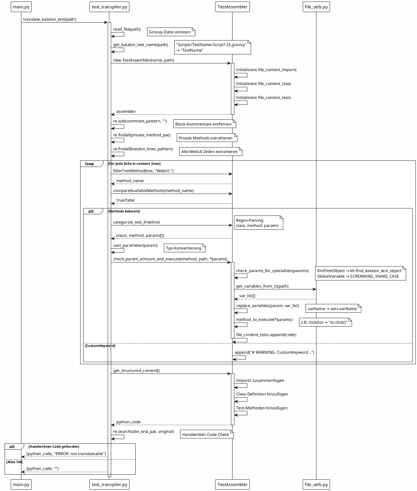

# Transpilation Process - Detailed Data Flow Diagram

Dieses Diagramm zeigt den detaillierten Datenfluss während der Transpilation eines Katalon-Tests zu Python/Pytest.

## Übersichtsdiagramm (Mermaid)

```mermaid
flowchart TB
    subgraph Input["INPUT"]
        A["Scripts/TestName/Script123456.groovy<br/>Katalon Groovy Test Code"]
    end

    subgraph Phase1["Schritt 1: Datei einlesen"]
        B["read_file()<br/>Datei einlesen als String"]
        C["get_katalon_test_name()<br/>Testname aus Pfad extrahieren"]
    end

    subgraph Phase2["Schritt 2: Comment & Custom Method Filtering"]
        D["Regex 1: Block-Kommentare entfernen<br/>siehe Tabelle unten"]
        E["Regex 2: Private Methoden extrahieren<br/>siehe Tabelle unten"]
        F["Custom Methods → Docstring-Archiv<br/>falls nicht übersetzbar"]
    end

    subgraph Phase3["Schritt 3: Line Extraction"]
        G["Regex 3: Katalon-Zeilen filtern<br/>WebUI + CustomKeywords matchen"]
        H["content_lines Array<br/>WebUI.click, WebUI.setText, etc."]
    end

    subgraph Phase4["Schritt 4: Method Parsing pro Zeile"]
        I["filterTestMethod<br/>WebUI.click → click"]
        J["compareAvailableMethods<br/>32 bekannte Methoden"]
        K{"Methode<br/>bekannt?"}
        L["categorize_test_line<br/>Regex 4: Klasse.Methode parsen"]
        M["Parameter-Splitting<br/>Regex 5: Komma-Trennung"]
    end

    subgraph Phase5["Schritt 5: Parameter Transformation"]
        N["Regex 6: findTestObject erkennen<br/>→ kh.find_katalon_test_object"]
        O["Regex 7: findTestData erkennen<br/>→ kh.find_katalon_test_data"]
        P["normalize_global_variables<br/>Regex 8: → SCREAMING_SNAKE_CASE"]
        Q["replace_variables<br/>varName → vars.varName"]
    end

    subgraph Phase6["Schritt 6: Code Generation"]
        R["Method Dispatch<br/>getattr self, method_name"]
        S["Katalon → Selenium Mapping<br/>click → to.click<br/>setText → to.clear + send_keys"]
        T["file_content_tests.append<br/>Python-Code sammeln"]
    end

    subgraph Phase7["Schritt 7: Output Assembly"]
        U["get_structured_content<br/>Imports + Class + Tests"]
        V["Regex 9: Handwritten Code Check<br/>String, if, TestObject"]
        W{"Handwritten<br/>Code?"}
    end

    subgraph Output["OUTPUT"]
        X["test_TestName.py<br/>Vollständiger Python Pytest Code"]
        Y["unreadable_tests/TestName.groovy<br/>ERROR + Original Groovy Code"]
    end

    A --> B --> C
    C --> D --> E
    E --> F
    D --> G --> H
    H --> I --> J --> K
    K -->|Ja| L --> M
    K -->|Nein| Y
    M --> N --> O --> P --> Q
    Q --> R --> S --> T
    T --> U --> V --> W
    W -->|Nein| X
    W -->|Ja| Y

    style Input fill:#e8f4f8,stroke:#333
    style Output fill:#c8f4c8,stroke:#333
    style Phase1 fill:#fff3e0,stroke:#333
    style Phase2 fill:#fff3e0,stroke:#333
    style Phase3 fill:#fff3e0,stroke:#333
    style Phase4 fill:#ffe8c8,stroke:#333
    style Phase5 fill:#ffe8c8,stroke:#333
    style Phase6 fill:#d4edda,stroke:#333
    style Phase7 fill:#d4edda,stroke:#333
```



---

## Detaillierte Regex-Pattern Referenz

| # | Pattern Name | Regex | Zweck | Beispiel |
|---|-------------|-------|-------|----------|
| 1 | `comment_pattern` | `/\*[^*]*\*+(?:[^/*][^*]*\*+)*/` | Block-Kommentare `/* ... */` entfernen | `/* TODO */` → (entfernt) |
| 2 | `private_method_pat` | `private void .*{\n[\s\w.\(\)=\"\,'\/\[@\-\]\\;\<{}]*\n}` | Private Methoden extrahieren | `private void helper() {...}` → Docstring |
| 3 | `default_katalon_lines_pattern` | `\/\*\|\/\/.+\|\/\*.+\|WebUI.+\n.+\|WebUI.+\|CustomKeywords.*` | Relevante Katalon-Zeilen filtern | `WebUI.click(...)` → match |
| 4 | `katalon_code_pattern` | `(\w+)\.(\w+)\((.*)\)` | Klasse, Methode, Parameter extrahieren | `WebUI.click(obj)` → `WebUI`, `click`, `obj` |
| 5 | `param_pattern` | `,\s+(?=false)\|(?!\]),\s(?=Fail.*)\|...` | Parameter-Liste splitten | `obj, 'text', false` → `['obj', "'text'", 'false']` |
| 6 | `fto_param_str_pattern` | `(findTestObject\(('.+').*\))` | TestObject-Referenz erkennen | `findTestObject('Page/btn')` → `kh.find_katalon_test_object(...)` |
| 7 | `ftd_param_str_pattern` | `(findTestData\(('.+').*\)\.getValue\((.+)\))` | TestData-Referenz erkennen | `findTestData('data').getValue(1, 2)` → `kh.find_katalon_test_data(...)` |
| 8 | `GlobalVariable pattern` | `GlobalVariable\.([A-Za-z_][A-Za-z0-9_]*)` | GlobalVariable normalisieren | `GlobalVariable.url` → `GlobalVariable.URL` |
| 9 | `abn_test_pat` | `String\s\w+\s=\|if\(\|TestObject\s\w+\s=` | Handwritten Code erkennen | `String x = "test"` → ERROR |

---

## Sequenzdiagramm (PlantUML Format)



---

## Daten-Transformation Beispiel

### Input (Katalon Groovy)
```groovy
WebUI.openBrowser('')
WebUI.navigateToUrl(GlobalVariable.url)
WebUI.click(findTestObject('Page_Login/btn_submit'))
WebUI.setText(findTestObject('Page_Login/input_email'), email)
WebUI.verifyTextPresent('Welcome', false)
WebUI.closeBrowser()
```

### Transformation Steps

| Step | Transformation | Result |
|------|---------------|--------|
| 1. Read | Datei als String | `"WebUI.openBrowser('')\nWebUI.navigate..."` |
| 2. Filter | Kommentare entfernen | (keine Änderung) |
| 3. Extract | WebUI-Zeilen filtern | `['WebUI.openBrowser(...)', 'WebUI.navigateToUrl(...)', ...]` |
| 4. Parse | `categorize_test_line()` | `('WebUI', 'click', ["findTestObject('Page_Login/btn_submit')"])` |
| 5. Transform fTO | `findTestObject → kh.find_katalon_test_object` | `kh.find_katalon_test_object(self.driver, 'Page_Login/btn_submit')` |
| 6. Transform GV | `GlobalVariable.url → GlobalVariable.URL` | `GlobalVariable.URL` |
| 7. Transform Var | `email → vars.email` | `vars.email` |
| 8. Generate | Katalon → Selenium | `kh.find_katalon_test_object(...).click()` |
| 9. Assemble | Imports + Class + Tests | Vollständige Python-Datei |

### Output (Python Pytest)
```python
import pytest
import time
import src.runtime.katalon_helpers as kh

from src.runtime.base_test import *
from src.profiles.global_variables import GlobalVariables as GlobalVariable
from selenium.webdriver.support.ui import Select
from src.variables.var_TestName import TestName as vars

class Test_TestName(BaseTest):
    def test_TestName(self):
        
        self.driver.get(GlobalVariable.URL)
        kh.find_katalon_test_object(self.driver, 'Page_Login/btn_submit').click()
        kh.find_katalon_test_object(self.driver, 'Page_Login/input_email').clear()
        kh.find_katalon_test_object(self.driver, 'Page_Login/input_email').send_keys(vars.email)
        assert 'Welcome' in self.driver.page_source
```

---

## Draw.io Export

Für draw.io kann das Mermaid-Diagramm unter https://mermaid.live/ gerendert und als SVG/PNG exportiert werden.

Alternativ hier ein draw.io XML-Fragment für manuellen Import:

```xml
<!-- Draw.io kann Mermaid direkt importieren via: Arrange → Insert → Advanced → Mermaid -->
```
