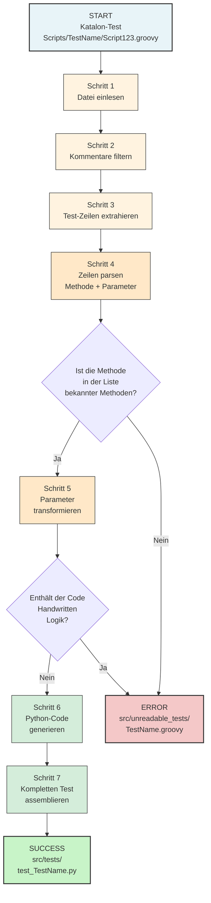

# Transpilation Process - Vereinfachtes Datenfluss-Diagramm

Dieses Diagramm zeigt den Transformationsprozess einer Katalon-Test-Datei zu einem Python-Pytest-Test, fokussiert auf die Datenpfade und Transformationsschritte ohne interne Implementierungsdetails.

---

## Hauptdiagramm: Transformationspfade



---

## Regex-Pattern Referenztabelle

Diese Tabelle zeigt, welche Regex-Pattern in jedem Schritt des Diagramms verwendet werden:

| Schritt | Pattern Nr. | Name | Regex Pattern | Zweck |
|---------|------------|------|---------------|-------|
| **2** | P1 | `comment_pattern` | `/\*[^*]*\*+(?:[^/*][^*]*\*+)*/` | Block-Kommentare entfernen |
| **2** | P2 | `private_method_pat` | `private void .*{\n...}` | Private Methoden extrahieren |
| **3** | P3 | `katalon_lines_pattern` | `WebUI.+\|CustomKeywords.*` | Relevante Zeilen filtern |
| **4** | P4 | `katalon_code_pattern` | `(\w+)\.(\w+)\((.*)\)` | Klasse.Methode(Parameter) parsen |
| **4** | P5 | `param_pattern` | `,\s+(?=false)\|(?!\]),\s...` | Parameter-Liste splitten |
| **5** | P6 | `fto_param_pattern` | `findTestObject\(('.+').*\)` | TestObject-Referenzen umschreiben |
| **5** | P7 | `ftd_param_pattern` | `findTestData\(('.+').*\)` | TestData-Referenzen umschreiben |
| **5** | P8 | `global_var_pattern` | `GlobalVariable\.([A-Za-z_]\w*)` | GlobalVariablen normalisieren |
| **7** | P9 | `abn_test_pattern` | `String\s\w+\s=\|if\(` | Handwritten-Code erkennen |

---

## Konkrete Daten-Transformation

### Input-Beispiel (Katalon Groovy)

```groovy
WebUI.click(findTestObject('Page_Login/button'))
WebUI.setText(input_field, "username")
WebUI.verifyTextPresent('Login Success')
```

### Pfad durch die Schritte

| Schritt | Datenstand | Erklärung |
|---------|-----------|-----------|
| **Start** | `Scripts/TestName/Script123.groovy` | Eingabedatei |
| **Schritt 1** | Gesamte Datei als String | Dateiinhalt eingelesen |
| **Schritt 2** | Kommentare entfernt | Pattern P1, P2 angewendet |
| **Schritt 3** | `['WebUI.click(...)', 'WebUI.setText(...)', ...]` | Pattern P3 filtern relevante Zeilen |
| **Schritt 4** | Pro Zeile: `('WebUI', 'click', params)` | Pattern P4, P5 parsen |
| **Check 1** | `click` in known methods? | 32 vordefinierte Methoden |
| **Schritt 5** | `findTestObject(...) → kh.find_katalon_test_object(...)` | Pattern P6-P8 transformieren |
| **Check 2** | Handwritten Code vorhanden? | Pattern P9 prüfen |
| **Schritt 6** | `kh.find_katalon_test_object(...).click()` | Python Selenium Code |
| **Schritt 7** | Imports + Klasse + Methode | Vollständige Datei assemblieren |
| **Output** | `src/tests/test_TestName.py` | Fertige Python-Test-Datei |

### Output-Beispiel (Python Pytest)

```python
import pytest
from src.runtime.base_test import *
from src.runtime.katalon_helpers as kh

class Test_TestName(BaseTest):
    def test_TestName(self):
        kh.find_katalon_test_object(self.driver, 'Page_Login/button').click()
        input_field.clear()
        input_field.send_keys("username")
        assert 'Login Success' in self.driver.page_source
```

---

## Fehlerszenarien

### Fehler bei Schritt 4: Unbekannte Methode
- **Bedingung**: Methode nicht in `translate_methods_list` (32 bekannte Methoden)
- **Aktion**: Datei wird zu `src/unreadable_tests/` geschrieben
- **Inhalt**: ERROR-Nachricht + Original Groovy Code

### Fehler bei Schritt 7: Handwritten Code
- **Bedingung**: Pattern P9 findet `String varName = ...` oder `if(...)` oder `TestObject ...`
- **Aktion**: Datei wird zu `src/unreadable_tests/` geschrieben
- **Grund**: Diese Konstrukte erfordern manuelle Übersetzung

---

## Zusammenfassung

- **Schritte 1-3**: **Datenbereinigung & Extraktion** (Input-Phase)
- **Schritte 4-5**: **Parsing & Transformation** (Core-Phase)
- **Schritte 6-7**: **Code-Generierung & Assembly** (Output-Phase)

Jeder Schritt kann anhand der Regex-Pattern-Tabelle genauer untersucht werden.
